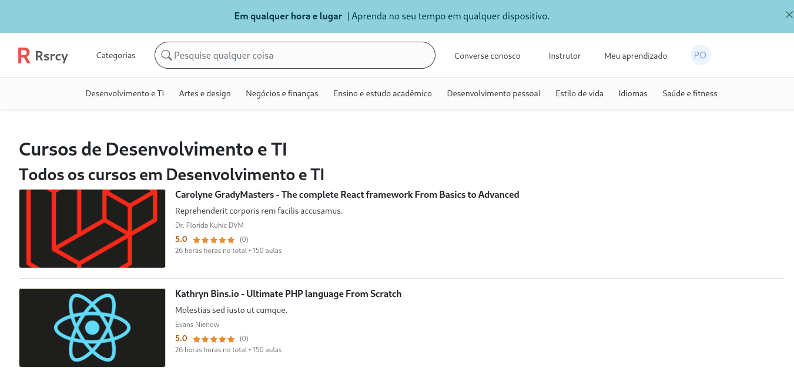

<p align="center">
    
</p>

<h1 align="center">Resourcery</h1>
<p align="center">An Udemy clone</p>

## Getting Started

### Prerequisites
 - composer
 - npm or yarn
 - mysql

### Installing

A step by step series of examples that tell you how to get a development env running

Cloning project and installing packages

```
https://github.com/seapvnk/resourcery.git
cd resourcery
npm i
composer install
```

Creating the project database

```
sudo systemctl start mysql
sudo mysql -u root p

# mariadb console
sudo mysql -u root -p
create database resourcery character set utf8mb4 collate utf8mb4_unicode_ci;
```
then fill your .env file like this:
```
...
DB_CONNECTION=mysql
DB_HOST=localhost
DB_PORT=3306
DB_DATABASE=resourcery
DB_USERNAME=root
DB_PASSWORD=123
```

after setup the database run the migrations and seed the dabatase
```
php artisan migrate
php artisan db:seed
```

Now serve the project in localhost
```
php artisan serve
```

## Built With

* [Laravel](https://laravel.com/) - The web framework used
* [Composer](https://getcomposer.org/) - Dependency Management

## Authors

* **Pedro Sérgio** - *Initial work* - [seapvnk](https://github.com/seapvnk)

## License

This project is licensed under the MIT License - see the [LICENSE.md](LICENSE.md) file for details

